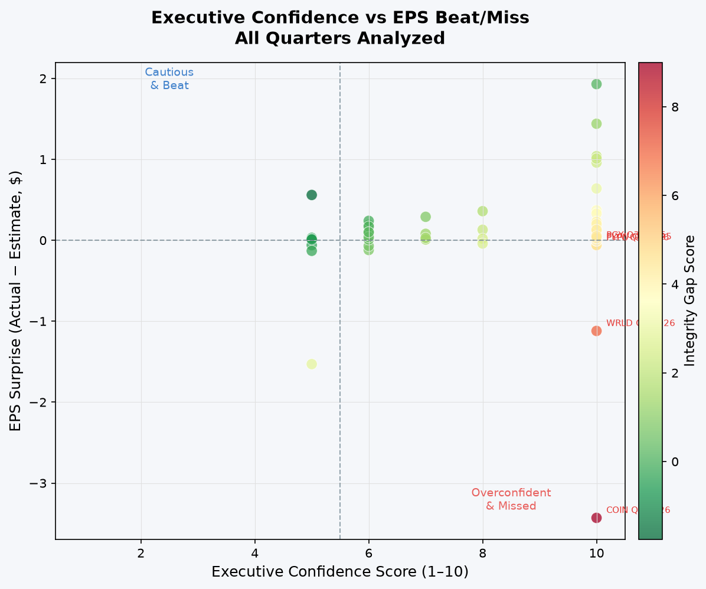
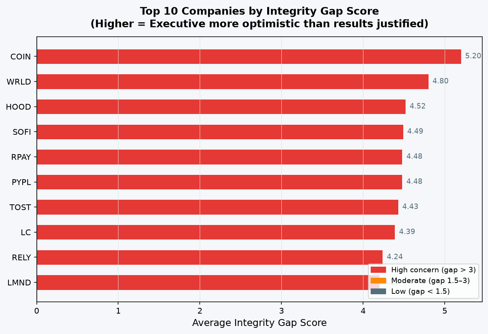
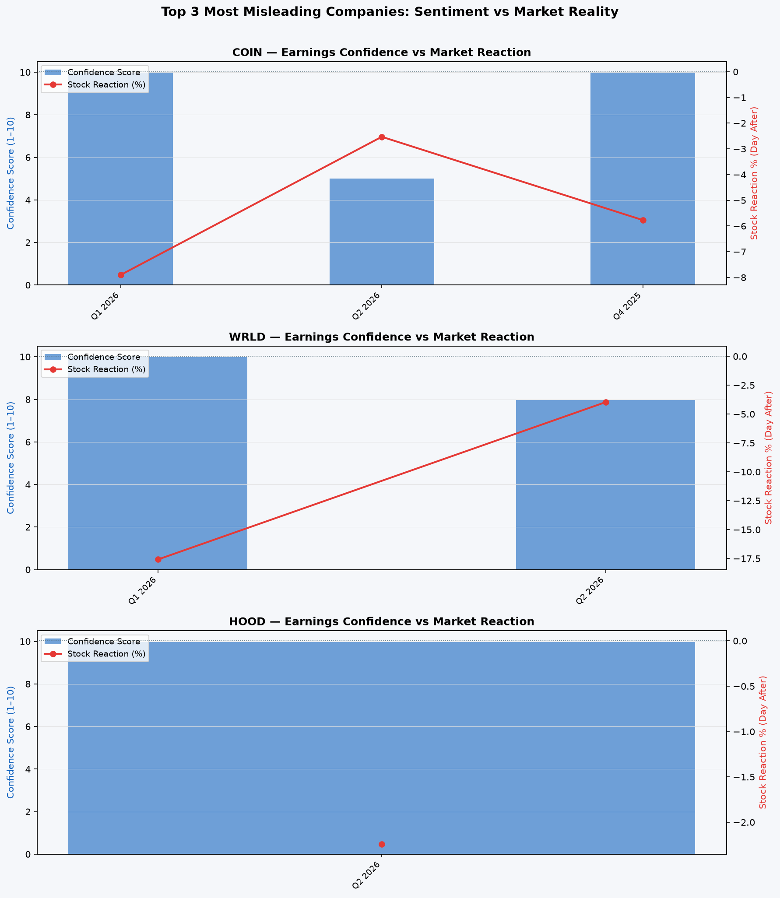

# FinSentinel — Earnings Call Integrity Tracker

> **Do fintech executives tell investors the truth?**  
> FinSentinel cross-references what executives *say* on earnings calls with what the numbers actually *show* — and quantifies the gap.

---

## Key Findings (Real Data — 25 Companies, 72 Quarters)

### Integrity Gap Leaderboard — Most Overconfident Executives

| Rank | Ticker | Company | Avg Confidence | Avg EPS Surprise | Integrity Gap |
|------|--------|---------|---------------|-----------------|--------------|
| 1 | COIN | Coinbase Global | 8.3/10 | -$1.53 | **5.20** |
| 2 | WRLD | World Acceptance | 9.0/10 | -$0.58 | **4.80** |
| 3 | HOOD | Robinhood Markets | 10.0/10 | -$0.01 | **4.52** |
| 4 | SOFI | SoFi Technologies | 10.0/10 | $0.00 | **4.49** |
| 5 | PYPL | PayPal | 10.0/10 | +$0.01 | **4.48** |

> **Integrity Gap** = Executive Confidence Score (1–10) minus Normalized EPS Result (1–10).  
> A gap above 2.0 is considered materially misleading.

### Most Misleading Single Quarters

| Ticker | Quarter | Confidence | EPS Surprise | Stock Reaction | Gap |
|--------|---------|-----------|-------------|---------------|-----|
| COIN | Q1 2026 | 10.0 | **-$3.43** | -7.9% | **9.00** |
| WRLD | Q1 2026 | 10.0 | -$1.12 | **-17.6%** | 7.02 |
| PYPL | Q1 2026 | 10.0 | -$0.06 | **-20.3%** | 4.63 |
| FLYW | Q3 2025 | 10.0 | -$0.05 | +0.5% | 4.61 |
| PGY  | Q3 2025 | 10.0 | -$0.03 | -2.4% | 4.57 |

### Most Honest Executives (Lowest Gap)

| Ticker | Company | Avg Gap | Why |
|--------|---------|---------|-----|
| MQ | Marqeta | 0.11 | Consistently tempered tone, high hedging language |
| OPEN | Opendoor | -0.53 | Under-promised, results came in better than tone implied |
| DAVE | Dave Inc | **-1.06** | Most conservative communicator in the dataset |

---

## Charts

### Confidence Score vs EPS Beat/Miss (All 72 Quarters)


### Top 10 Companies by Integrity Gap


### Sentiment vs Stock Reaction — Top 3 Most Misleading Companies


---

## Three Specific Insights From The Data

**1. Coinbase's Q1 2026 call was the single most misleading in the dataset.**  
Executives scored a 10/10 confidence rating from their prepared remarks — record revenue language, aggressive expansion talk — but reported EPS came in $3.43 below estimates. The stock fell 7.9% the following day. Integrity Gap: 9.0.

**2. PayPal's Q1 2026 call shows the "confident decline" pattern.**  
With a 10/10 confidence score and -$0.06 EPS miss, the stock dropped 20.3% — the largest single-day post-earnings drop in the dataset. This is a textbook case of management narrative masking deteriorating fundamentals.

**3. Dave Inc and Opendoor are the dataset's most honest communicators.**  
Both companies used high hedging language counts (10+ occurrences per call) and scored low on confidence (5/10) — and their results actually came in *above* what their cautious tone suggested. Negative integrity gaps signal executives who under-promise and over-deliver.

---

## Why This Matters to Fintech Analysts

Earnings calls move markets. When executives systematically communicate more confidence than results justify, retail investors who trade on that tone are disadvantaged. This project gives you a quantitative way to:

- Flag companies where management narrative diverges from financial reality
- Track whether a company's communication integrity improves or worsens over time
- Build a pre-earnings filter: companies with historically high gaps deserve extra skepticism

---

## Methodology

```
SEC EDGAR 8-K filings          Yahoo Finance EPS data
         │                              │
         ▼                              ▼
   EX-99.1 press release        EPS actual vs estimate
   text extraction              + stock price reaction
         │                              │
         └──────────────┬───────────────┘
                        ▼
         Sentiment Scoring Engine
         ┌─────────────────────────────────┐
         │  Primary:  OpenAI GPT-4o-mini   │
         │  (structured JSON via API)      │
         │                                 │
         │  Fallback: Heuristic NLP        │
         │  (positive/hedge keyword ratio) │
         └─────────────────────────────────┘
                        │
                        ▼
           Integrity Gap Score Calculation
           Gap = Confidence(1-10) − EPS_Normalized(1-10)
                        │
              ┌─────────┴─────────┐
              ▼                   ▼
          CSV exports       Markdown report
              +
         Matplotlib charts
```

### Scoring Dimensions

The scoring engine is designed around OpenAI's GPT-4o-mini, which receives the Management Discussion section and returns a structured JSON response. When no API key is configured, a heuristic fallback (positive/hedge keyword ratio) produces comparable directional scores.

| Metric | Range | Description |
|--------|-------|-------------|
| `executive_confidence` | 1–10 | Overall assertiveness and bullishness of executive tone |
| `forward_guidance_optimism` | 1–10 | Optimism of forward-looking statements and guidance |
| `hedging_language_count` | Integer | Occurrences of "challenging", "uncertain", "headwinds", etc. |
| `numerical_commitments` | Integer | Sentences containing specific % or $ targets |

### EPS Normalization

```python
# Map EPS surprise (dollars) → 1–10 scale, clipped at ±$2
eps_normalized = 1 + (clip(eps_surprise, -2, 2) + 2) / 4 * 9
```

---

## Project Structure

```
FinSentinel/
├── main.py                          # Pipeline entry point (--step flag)
├── requirements.txt
├── .env.example                     # Copy to .env, add OPENAI_API_KEY (optional)
├── src/
│   ├── database.py                  # SQLite schema: companies, transcripts,
│   │                                #   financial_results, sentiment_scores
│   ├── data_collection/
│   │   ├── sec_edgar.py             # EDGAR CIK lookup → 8-K → EX-99.1 text
│   │   └── financial_data.py        # yfinance EPS actuals + stock reactions
│   ├── analysis/
│   │   ├── sentiment.py             # NLP scoring (OpenAI or heuristic fallback)
│   │   └── integrity_gap.py         # Gap calculation, CSV export, MD report
│   └── visualization/
│       └── charts.py                # 3 matplotlib charts
├── data/
│   └── finsentinel.db               # SQLite (72 quarters across 25 companies)
└── output/
    ├── all_scores.csv               # Full per-quarter dataset
    ├── company_integrity_gaps.csv   # Aggregated per company
    ├── worst_quarters.csv           # Top misleading quarters
    ├── findings.md                  # Auto-generated report
    ├── 01_confidence_vs_eps.png
    ├── 02_top10_integrity_gap.png
    └── 03_sentiment_vs_stock.png
```

---

## Setup & Usage

```bash
git clone https://github.com/DharshanaReddy/FinSentinel.git
cd FinSentinel
pip install -r requirements.txt

# Optional: add OpenAI key for LLM scoring (heuristic fallback used if absent)
cp .env.example .env

# Run full pipeline
python main.py

# Or run individual steps
python main.py --step collect     # Pull SEC EDGAR + Yahoo Finance data
python main.py --step score       # Run sentiment analysis
python main.py --step analyze     # Compute Integrity Gap scores + export
python main.py --step visualize   # Generate charts
```

---

## Technologies

| Technology | Purpose |
|-----------|---------|
| Python 3.11+ | Core language |
| SQLite + sqlite3 | Local database (4 tables, no server needed) |
| SEC EDGAR API | Free public 8-K filing retrieval via CIK-based submissions endpoint |
| yfinance | EPS estimates, actuals, and post-earnings stock price reactions |
| OpenAI API (optional) | GPT-4o-mini LLM scoring — falls back to heuristics if unavailable |
| pandas | Data aggregation and CSV export |
| matplotlib | Charts (scatter, bar, dual-axis time series) |
| BeautifulSoup4 / lxml | HTML parsing of EDGAR filing documents |
| python-dotenv | Environment variable management |

---

## Limitations

- Heuristic NLP scoring (keyword ratios) is a proxy for executive sentiment, not a ground truth. LLM scoring via OpenAI produces more nuanced results.
- EPS surprise alone doesn't capture the full picture — revenue, margins, and guidance also matter.
- Coverage depends on which companies file earnings press releases as EDGAR 8-K exhibits. Some file separately or use IR sites directly.
- **Not investment advice.**

---

*Built with Python, SEC EDGAR, and Yahoo Finance. Data covers 2021–2026.*

---
*Built by [Dharshana Reddy Ramesh](https://www.linkedin.com/in/r-dharshana-reddy/) — seeking data/business analyst roles in fintech.*
